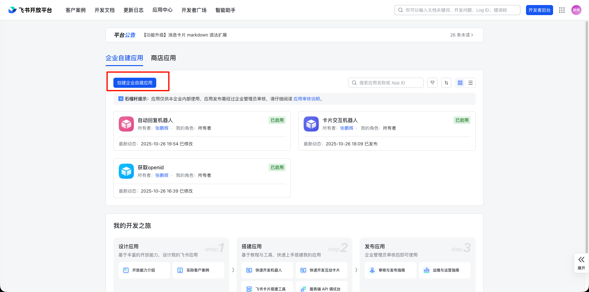
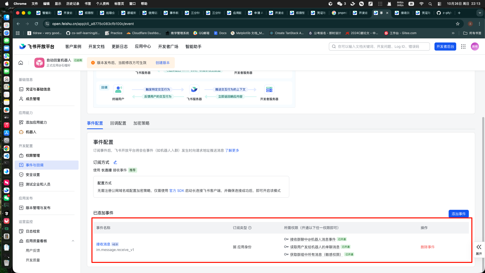
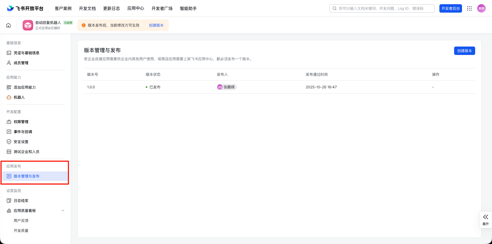

# claude 回复机器人

# 1.前提条件
## 1.1 创建应用

## 1.2 添加机器人权限和事件

## 1.3 发布应用



# 2.服务端部署步骤（可直接部署在个人电脑，无需公网IP和域名）
## 2.1 填写配置
```
# 飞书应用配置
APP_ID=your_id
APP_SECRET=your_secret
BASE_DOMAIN=https://open.feishu.cn
APP_NAME=your_bot_name(可选)

# 机器人身份标识（用于@检测）
BOT_OPEN_ID=your_bot_open_id
# Claude API 配置
ANTHROPIC_BASE_URL=your_base_url
ANTHROPIC_AUTH_TOKEN=your_auth_token
```
## 2.2 运行
> pnpm i && pnpm test:env && pnpm dev
## 3. 在群组中添加刚才创建的机器人

然后就可以@刚才创建的机器人，自动回答你的问题了（只有手动@才会回答，不@是不会回答的）