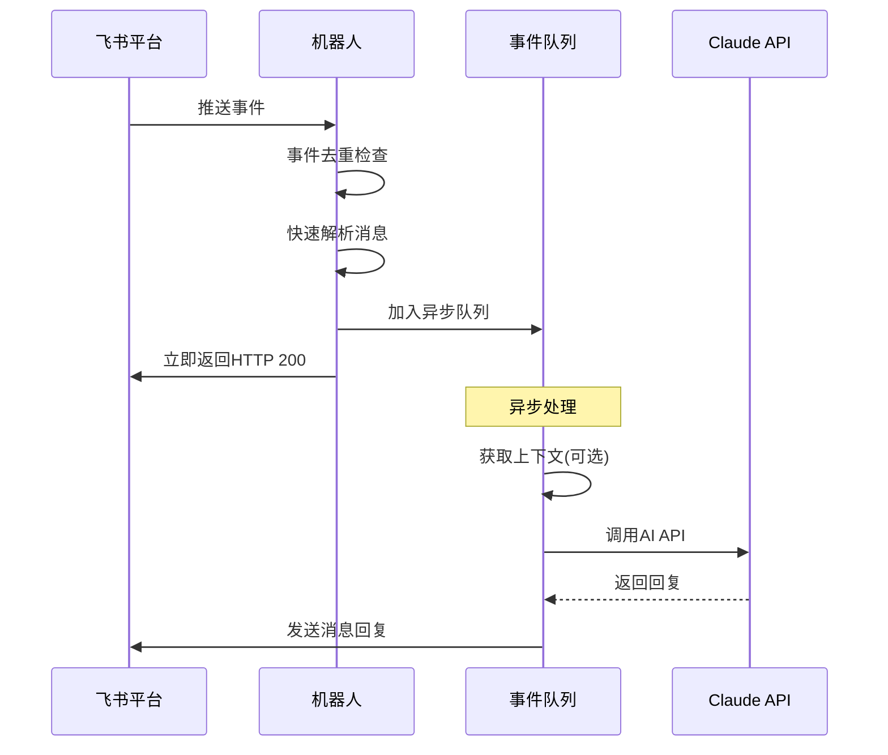

# 飞书 + Claude 聊天机器人 (模块化版本)

## 架构概述

本版本实现了飞书开放平台的**至少一次(at-least-once)事件传递策略**，确保在高并发和网络不稳定情况下的可靠事件处理。

## 核心特性

### 1. At-Least-Once 事件传递
- **立即HTTP 200响应**: 收到事件后立即返回成功响应，避免飞书重试
- **异步业务处理**: 将耗时的AI处理逻辑放入队列异步执行
- **事件去重**: 支持 `event_id` (v2.0) 和 `uuid` (v1.0) 的去重机制
- **错误隔离**: 业务逻辑失败不影响HTTP响应状态

### 2. 模块化架构
```
nodejs/
├── index_modular.js          # 主入口文件
├── config/
│   └── larkConfig.js         # 飞书配置
├── services/
│   ├── claudeService.js      # Claude AI服务
│   ├── contextService.js     # 上下文服务
│   └── messageService.js     # 消息服务
├── utils/
│   ├── eventDeduplicator.js  # 事件去重
│   ├── eventQueue.js         # 事件队列
│   └── eventDetector.js      # 事件检测
└── README_modular.md         # 本文档
```

### 3. 错误处理和重试
- **队列错误计数**: 连续错误达到阈值时自动暂停
- **降级处理**: API失败时发送备用响应
- **监控日志**: 详细的处理日志便于问题排查

## 工作流程



## 关键改进

### 1. 事件处理流程
- **之前**: 同步处理所有逻辑，可能导致超时重试
- **现在**: 快速响应 + 异步处理，避免重试风暴

### 2. 去重机制
- **之前**: 仅使用 `message_id` 去重
- **现在**: 支持多种标识符：
  - `event_id` (v2.0事件)
  - `uuid` (v1.0事件)
  - `message_id` (兜底方案)

### 3. 错误处理
- **之前**: 错误可能导致整个流程失败
- **现在**: 多层错误处理，确保响应始终返回

## 使用方法

### 1. 环境配置
确保 `.env` 文件包含必要配置：
```bash
ANTHROPIC_BASE_URL=your_claude_base_url
ANTHROPIC_AUTH_TOKEN=your_claude_token
APP_ID=your_app_id
APP_SECRET=your_app_secret
BASE_DOMAIN=https://open.feishu.cn
```

### 2. 启动机器人
```bash
node index_modular.js
```

### 3. 监控日志
机器人会输出详细的处理日志：
```
🚀 启动飞书 + Claude 聊天机器人 (模块化版本)...
✅ 机器人已启动，等待消息...
🔄 已启用 at-least-once 事件传递策略

=== 收到飞书事件 ===
✅ 事件已加入异步队列，HTTP 200响应即将返回
🔄 飞书不会重试，业务逻辑将异步处理
```

## 性能特点

### 响应时间
- **HTTP响应**: < 10ms (立即返回)
- **消息处理**: 异步执行，不阻塞响应

### 并发处理
- **事件接收**: 支持高并发，无阻塞
- **队列处理**: 串行处理，避免API限流

### 容错能力
- **网络波动**: 不影响事件处理
- **API失败**: 自动降级和重试
- **重复事件**: 自动去重，避免重复处理

## 故障排查

### 1. 事件重复
检查日志中的 `🔄 检测到重复事件` 提示，确认去重机制工作正常。

### 2. 队列积压
查看 `📋 事件已加入队列，队列长度: X` 日志，监控队列状态。

### 3. API错误
检查Claude API调用相关日志，确认服务可用性。

### 4. 权限问题
查看上下文获取失败的错误代码(如99991672)，确认权限配置。

## 升级指南

从旧版本升级到模块化版本：

1. **备份现有配置**
2. **更新环境变量** (如有变化)
3. **使用新的入口文件**: `node index_modular.js`
4. **监控运行状态**，确认功能正常

## 注意事项

1. **依赖管理**: 确保所有npm包已正确安装
2. **环境变量**: 检查配置完整性
3. **网络环境**: 确保能访问飞书和Claude API
4. **权限配置**: 确认机器人具有必要权限

## 扩展开发

模块化架构便于功能扩展：

- **新增服务**: 在 `services/` 目录添加
- **新增工具**: 在 `utils/` 目录添加
- **修改配置**: 在 `config/` 目录调整
- **事件处理**: 修改主文件中的事件处理器